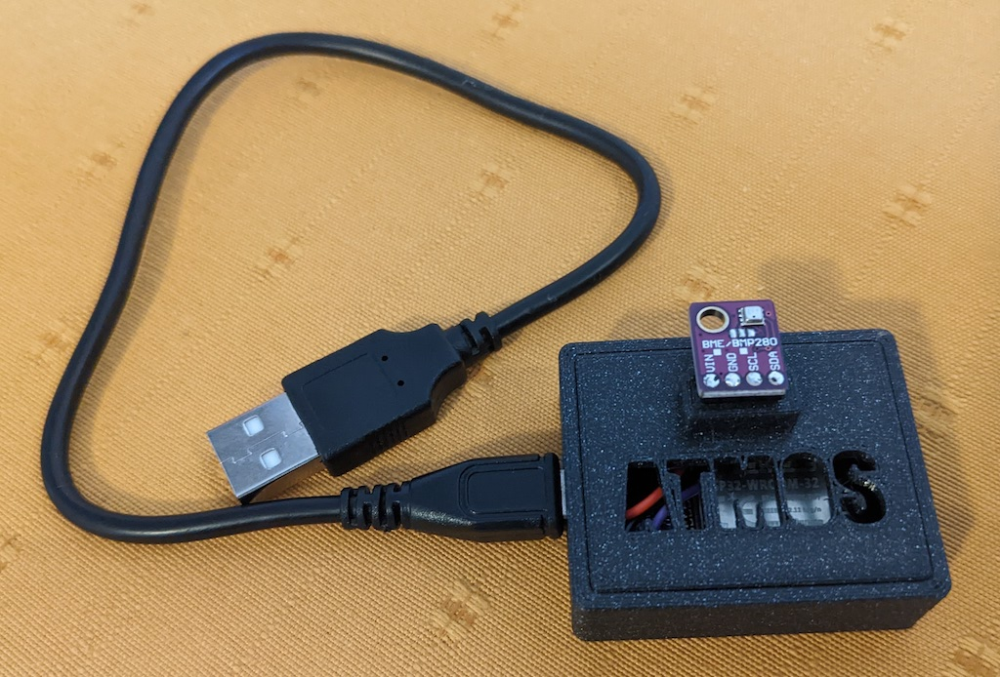

# Atmos

An ESP32 based home IoT device. It collects some climate readings for the room
and publishes them to MQTT.

These metrics can be consumed by subscribing to the MQTT topics. For example:
- In Home Assistant, to provide climate data for rooms and automation
- Writing to an InfluxDB database, so the data can be displayed on a Grafana
  Dashboard. For an example of such, see https://github.com/zefer/mqtt-to-influx

The ESP32 board is programmed using Arduino code, using [PlatformIO](https://platformio.org/).

## Hardware

- Made using an ESP32 D1 Mini board, but initially prototyped on an ESP32
  Devkit V4 board. The work the same and all that needs to change is the
  `board` type in `platformio.ini'
- Bosch BME280 barometric air pressure, humidity & temperature sensor

## GPIO Pins

Wired to the default ESP32 I2C pins as follows. Guides can be found at
https://randomnerdtutorials.com/esp32-bme280-arduino-ide-pressure-temperature-humidity/.

- ESP32 3.3v    -> BME280 VIN
- ESP32 GND     -> BME280 GND
- ESP32 GPIO 22 -> BME280 SCL
- ESP32 GPIO 21 -> BME280 SDA

## 3D-Printed Case

The deign and print files can be found here:
https://www.printables.com/model/290637-esp32-d1-mini-bme280-iot-sensor-case

## How it works

On first run, it creates a WiFi add-hoc network allowing you to configure the
WiFi and MQTT connection settings. These settings are persisted to flash
memory, subsequent runs will auto-connect to the configured WiFi and
periodically publish data to MQTT.

## API

- `GET /status` view JSON status data: config, system, metrics
- `PUT /reboot` reboot the device
- `PUT /reset` forget the WiFi & MQTT config and reboot

## Why?

To learn ESP32 development, to help with a future upcoming wind monitor
project. And also to collect some interesting climate data from various
locations around the house.

## Development

Install platformio core and refer to the `Makefile` for common dev commands.

See https://platformio.org/install/cli. I used `brew install platformio`.

- `make compile` compile the code
- `make upload` compile and flash to the device
- `make erase` fully erase the device flash, a factory reset
- `make serial` watch the serial output log

## Feature progress

- [x] Configure and connect to WiFi
- [x] Configure and persist MQTT config params
- [x] `GET /status` endpoint for general info and debugging
- [x] `PUT /reboot` and `PUT /reset` to assist with reconfiguring
- [x] Periodically read BME280 humidity, temperature & pressure values
- [ ] Consider adding a dewpoint calculation from humidity + temperature
- [x] Periodically publish BME280 readings to MQTT
- [x] Build an MQTT listener that subscribes to the readings and writes them to
  an InfluxDB, similar to
  [this UDP->InfluxDB energy monitor listener](https://github.com/zefer/energy-monitor)
- [x] Design and 3D-print an enclosure
- [ ] Verify the measurements, in particular temperature, and consider changing
  the case design to move the BME280 board further away from the ESP32 board
  and any heat it may radiate
